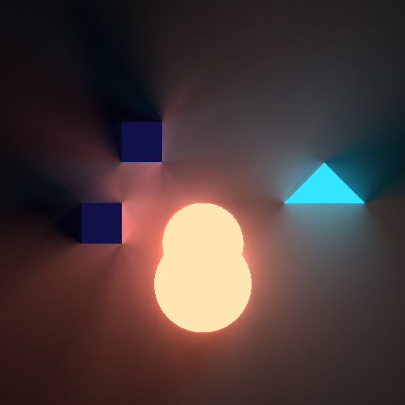
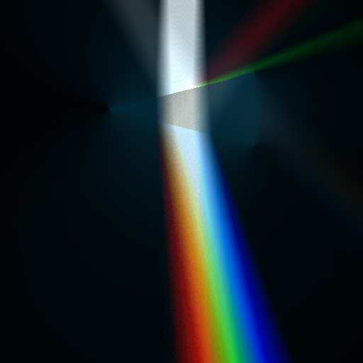
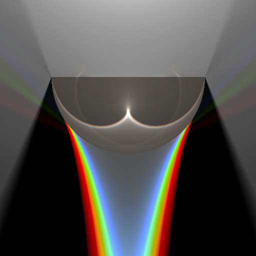
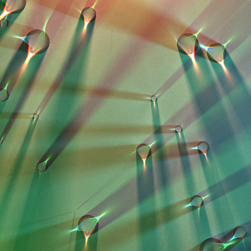

# cppLight2d

Chinese introduction can be seen at
[draw light with C++](https://zhuanlan.zhihu.com/c_149498082).

This project illustrates light rendering in 2D with C++.

All samples output PNGs with [svpng](https://github.com/miloyip/svpng).

I learn a lot from miloyip's project light2d, and try to do the same thing with C++.

The main idea is similar with milo's, following are the differences:

1. Ray intersection is used instead of ray marching to speed up, so no SDF(signed distance field), so only one calculation in one ray.
2. Only Line and Circle are used as basic shapes. Polygons are generated from lines.
3. Different refract indexes are given for different colors.

With the use of SDF, normal calculation can be written in less code , and easier to understand. 
While in my project, normals and intersect points are all calculated analytically. Maybe not so intuitive.
C++ polymorphism is great help to calculate different kinds of normals and intersect points.

# Example
an example of reflection

some examples of refraction

an example of a scene with QuadTree

# TODO
1. more entities
2. GUI
